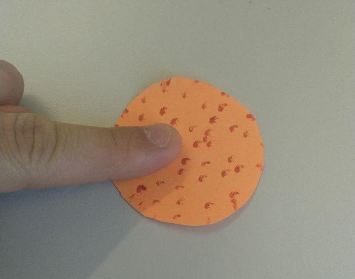
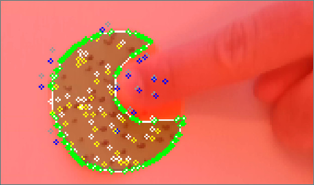

# Notice: abandoned

This project was developed for testing purposes for my master thesis and is now abandoned.

# Reconstructive optical flow

This is a prototype for a simple algorithm that should improve optical flows for 2D affine transformations.

Situation: A paper shape is on a flat table and a finger is playing around with it. A RealSense depth cam tracks the finger while the paper shape is flat. Now we want to use OpenCV's optical flow in order to track the movement of the shape.

## The problem with optical flow

Optical flow ignores the relationship between the points. It was built for tracking complex movement, whereas we simply have a rotation or translation in 2D, thus the distances between the points should remain the same. So then the finger partially covers the shape, optical flow points tend to be deviated.

## Goal

This algorithm intends to preserve the relationships between points by combining optical flow with best fit transform. It saves a snapshot of the initial points when the program starts. At each iteration it then tries to map the all those initial points to the points found by the optical flow algorithm.

Consider the following image from the program:

In this screenshot, the shape has slightly been moved to the bottom. You can see that the table and finger appear in red, this is a prohibitive mask on which all points will be considered invalid. The white points are the initial points that are not colliding with the mask, the gray points are the initial points ignored at this iteration (because they touch the red mask). We then use the OpenCV's optical flow to derive the yellow points. Finally the tranformation from the white to the yellow points is applied to all initial points (white and gray) to result in the blue points.

## Problems

When the paper shape has not enough structure, the optical flow algorithm moves the points away from the finger, causing the blue points to be off. Once off, the algorithm does not self-adjust again.
